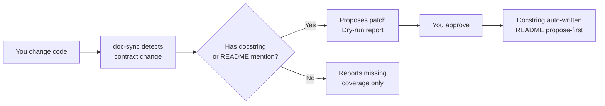

# doc-sync
[](https://tessl.io/registry/akshay-babbar/doc-sync)

An agentic skill for Claude Code, Windsurf, Cursor, and OpenCode that
auto-syncs docstrings and README when your code changes. When a function
signature changes, `doc-sync` finds every stale doc and proposes surgical
patches — dry-run first, writes only on your approval.



## Before / After

**Code change:**
```diff
- def fetch_user(user_id: int) -> User:
+ def fetch_user(user_id: int, include_profile: bool = False) -> User:
```

**Docstring — auto-written:**
```diff
  Args:
      user_id: The user's unique identifier.
+     include_profile: Whether to include profile data. Defaults to False.
```

**README — proposed, never auto-applied:**
```
- `fetch_user(user_id)` — fetches a user by ID.
+ `fetch_user(user_id, include_profile=False)` — fetches a user by ID.
```

## Install

### Via Tessl (recommended)

```bash
npx tessl install akshay-babbar/doc-sync
```

> **Note:** Tessl installs the skill into all platform directories simultaneously
> (`.claude/skills/`, `.cursor/skills/`, `.agents/skills/`, etc.) for cross-platform
> compatibility. You still need the per-platform setup described below.

### Claude Code

```bash
# Invoke
/doc-sync --dry-run    # preview — no writes
/doc-sync --apply      # write with confirmation
```

### Checking Committed Changes

By default, doc-sync checks uncommitted changes (working tree
vs last commit). If your changes are already committed, specify
a commit range:

```bash
/doc-sync --dry-run HEAD~1..HEAD    # check last commit
/doc-sync --dry-run HEAD~3..HEAD    # check last 3 commits
/doc-sync --apply HEAD~1..HEAD      # apply fixes for last commit
```

The markdown protection hook is pre-configured in `.claude/settings.json` and activates automatically when the skill is installed.

> **Note:** If doc-sync appears twice in Claude Code's Skills panel, this is
> expected — Tessl installs to both `.claude/skills/` and `.agents/skills/`
> for cross-platform compatibility. Both entries point to the same skill and
> behave identically. You can safely ignore the duplicate.

For automatic invocation after every commit:
```bash
# .git/hooks/post-commit
#!/bin/bash
claude -p "/doc-sync --dry-run"
```
```bash
chmod +x .git/hooks/post-commit
```

### Windsurf

After running `tessl install`, doc-sync is automatically available in
`.agents/skills/` — no manual setup needed. Windsurf reads skills from
this directory automatically.

### Cursor

After running `tessl install`, doc-sync is automatically available in
`.cursor/skills/` — no manual setup needed.

### OpenCode

```bash
mkdir -p ~/.config/opencode/skills
cp -r doc-sync ~/.config/opencode/skills/

# Add to opencode.json for markdown protection
{
  "permission": {
    "edit": { "*": "allow", "**/*.md": "ask", "**/*.mdx": "deny" }
  }
}
```

## How It Works

- **Docstrings** → auto-written (symbol-local, unambiguous, safe)
- **README mentions** → propose-first, never auto-applied
- **Removed / renamed symbols** → flagged `[NEEDS HUMAN REVIEW]`, never deleted
- **No existing docs** → reports missing coverage, creates nothing
- No AST parsing · No dependencies · Pure shell + git diff

## License

Apache 2.0