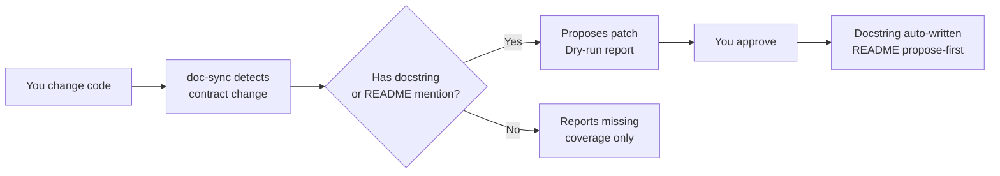

# doc-sync
[](https://tessl.io/registry/akshay-babbar/doc-sync)

An agentic skill for Claude Code, Windsurf, Cursor, and OpenCode that
auto-syncs docstrings and README when your code changes. When a function
signature changes, `doc-sync` finds every stale doc and proposes surgical
patches — dry-run first, writes only on your approval.



## Before / After

**Code change:**
```diff
- def fetch_user(user_id: int) -> User:
+ def fetch_user(user_id: int, include_profile: bool = False) -> User:
```

**Docstring — auto-written:**
```diff
  Args:
      user_id: The user's unique identifier.
+     include_profile: Whether to include profile data. Defaults to False.
```

**README — proposed, never auto-applied:**
```
- `fetch_user(user_id)` — fetches a user by ID.
+ `fetch_user(user_id, include_profile=False)` — fetches a user by ID.
```

## Install

### Via Tessl (recommended)

```bash
npx tessl add akshay-babbar/doc-sync
```

> **Note:** Tessl is a registry — like npm. It downloads the skill files.
> You still need one step per agent below to activate it. It does not
> auto-configure all agents on your machine simultaneously.

### Claude Code

```bash
mkdir -p ~/.claude/skills
cp -r doc-sync ~/.claude/skills/

# Invoke
/doc-sync --dry-run    # preview — no writes
/doc-sync --apply      # write with confirmation
```

The markdown protection hook is pre-configured in `.claude/settings.json` and activates automatically when the skill is installed.

For automatic invocation after every commit:
```bash
# .git/hooks/post-commit
#!/bin/bash
claude -p "/doc-sync --dry-run"
```
```bash
chmod +x .git/hooks/post-commit
```

### Windsurf

```bash
cd doc-sync && ./scripts/convert.sh /path/to/your/project
# Creates AGENTS.md in your project root
```

### Cursor

```bash
cd doc-sync && ./scripts/convert.sh /path/to/your/project
# Creates .cursor/rules/doc-sync.mdc in your project
```

### OpenCode

```bash
mkdir -p ~/.config/opencode/skills
cp -r doc-sync ~/.config/opencode/skills/

# Add to opencode.json for markdown protection
{
  "permission": {
    "edit": { "*": "allow", "**/*.md": "ask", "**/*.mdx": "deny" }
  }
}
```

## How It Works

- **Docstrings** → auto-written (symbol-local, unambiguous, safe)
- **README mentions** → propose-first, never auto-applied
- **Removed / renamed symbols** → flagged `[NEEDS HUMAN REVIEW]`, never deleted
- **No existing docs** → reports missing coverage, creates nothing
- No AST parsing · No dependencies · Pure shell + git diff

## License

Apache 2.0